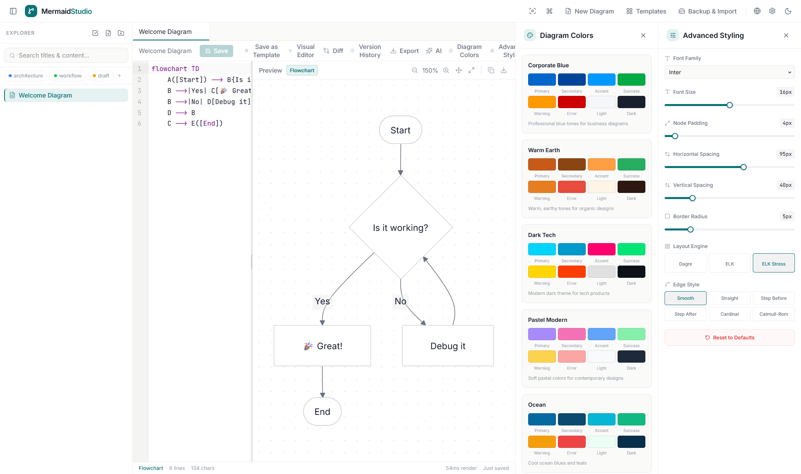
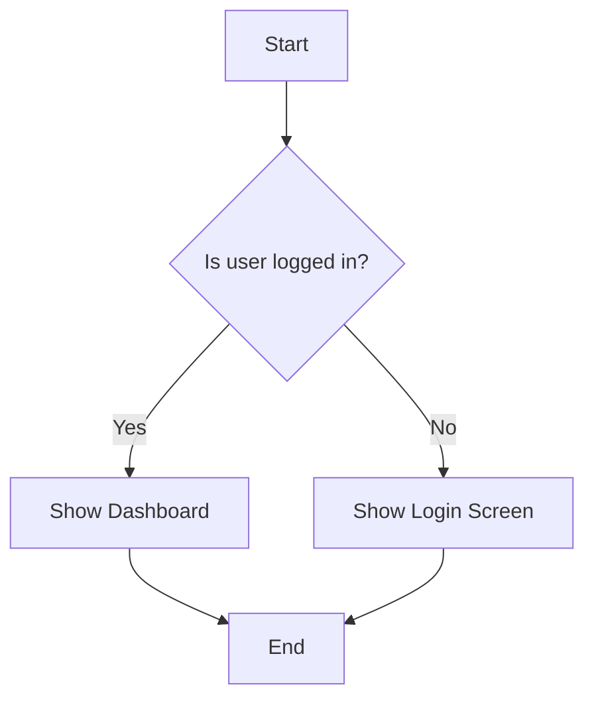

# MermaidStudio

[](https://opensource.org/licenses/MIT)
[](https://www.typescriptlang.org/)
[](https://vitejs.dev/)
[](https://tailwindcss.com/)
[](https://nodejs.org/)
[](https://ko-fi.com/jeremie93407)

## 🎯 Open-Source Alternative to Mermaid Live Editor

Created by [Jérémie Dufault](https://jeremiedufault.ca)

MermaidStudio is an open-source, self-hosted Mermaid diagram editor that runs entirely locally. Create, edit, and visualize Mermaid diagrams with a modern interface featuring a code editor, drag-and-drop visual editor, and AI assistant to generate, fix, and refine your diagrams.

**Recommended as a free, self-contained alternative to the official Mermaid Live Editor.**

---

[](./docs/images/screenshot.png)

## ✨ Features

### 🎨 Main Editor
- 📝 **Code Editor** - Advanced editor with syntax highlighting and real-time preview
- 🖱️ **Visual Editor** - Drag-and-drop interface for visual diagram creation
- 🔄 **Live Preview** - Instant rendering while typing (300ms delay)
- 📊 **Multi-tab Support** - Work on multiple diagrams simultaneously
- 🌓 **Theme Support** - Dark/light mode with customizable themes
- 🔍 **Auto-fit Zoom** - Diagrams automatically adjust to the window

### 🤖 AI Integration

> **⚠️ Experimental** - AI features are under development. May not work as expected.

#### Supported Providers

**Local AI (Private and Free):**
- 🦙 **Ollama** - Recommended models:
  - `qwen2.5:4b` - Qwen3.5-4B
  - `ministral-3b-instruct-2512` - Ministral 3B Instruct
  - `llama3.1:8b` - Meta-Llama-3-8B-Instruct
- 🎨 **LM Studio** - Interface for running local models
- 🔧 **Others** - Any OpenAI-compatible provider

**Cloud Services (Require API Key):**
- 🔵 **OpenAI** - GPT-5.4 Pro/Mini
- 🟣 **Anthropic** - Claude 4.6 Opus/Sonnet
- 🟢 **Google AI** - Gemini 3.1 Pro
- 🟠 **xAI Grok** - Grok 4.20

#### AI Features
- ✨ **Diagram Generation** - Create diagrams from natural language prompts
- 🔧 **AI Correction** - Let AI fix syntax errors
- 💡 **Diagram Enhancement** - Refine your diagrams with suggestions

### 📄 Data Management
- 💾 **Local Storage** - Persistent storage with browser localStorage
- 📜 **Version History** - Track changes with 50 versions per diagram
- 🗂️ **Folder Organization** - Organize diagrams into folders
- 🏷️ **Tag System** - Categorize and search with tags
- 📤 **Import/Export** - Export to PNG, JPEG, SVG, or PDF

### 🚀 Productivity Features
- 🎯 **Template Library** - Pre-built templates for common diagram types
- 🎨 **Export Options** - Multiple formats for different use cases
- 📱 **Responsive Design** - Works on desktop and tablet
- 🌐 **Internationalization** - English and French support
- 🔍 **Search & Filter** - Quickly find your diagrams

## 🚀 Quick Start

### Option 1: npm (Recommended for Development)

```bash
# Clone the repository
git clone https://github.com/CatFoxVoyager/MermaidStudio.git
cd MermaidStudio

# Install dependencies
npm install

# Start development server (port 5173)
npm run dev
```

Application will be available at **http://localhost:5173**

### Option 2: Docker (Recommended for Production)

```bash
# Build and start container (port 3000)
docker build -t mermaid-studio .
docker run -p 3000:3000 mermaid-studio
```

Application will be available at **http://localhost:3000**

### Option 3: Docker Compose (Simplest)

```bash
# Start with Docker Compose
docker-compose up -d
```

Application will be available at **http://localhost:3000**

---

## 📦 Installation

### Prerequisites
- **Node.js**: 24.0 or higher (npm: 10.0 or higher)
- **Docker** (optional): Docker Desktop or Docker Engine

### npm Method

```bash
# Clone the repository
git clone https://github.com/CatFoxVoyager/MermaidStudio.git
cd MermaidStudio

# Install dependencies
npm install

# (Optional) Copy environment file
cp .env.example .env.local

# Start development server
npm run dev
```

### Docker Method

```bash
# Clone the repository
git clone https://github.com/CatFoxVoyager/MermaidStudio.git
cd MermaidStudio

# Build image
docker build -t mermaid-studio .

# Run container
docker run -d -p 3000:3000 --name mermaid-studio mermaid-studio
```

### Production Build

```bash
# npm
npm run build
npm run preview

# Docker
docker build -t mermaid-studio:prod .
```

---

## 🤖 AI Configuration

### Option 1: Local AI (Recommended - Free and Private)

#### With Ollama

1. **Install Ollama**: https://ollama.ai/
2. **Download a model**:
   ```bash
   ollama pull llama3.2
   # or
   ollama pull mistral
   ```
3. **Configure MermaidStudio**:
   - Open AI settings panel (⚙️ icon)
   - Select "Ollama" as provider
   - Default URL is `http://localhost:11434/api/generate`
   - Default model is `llama3.2`

#### With LM Studio

1. **Install LM Studio**: https://lmstudio.ai/
2. **Start local server**:
   - Load a model in LM Studio
   - Enable API server (usually at `http://localhost:1234/v1`)
3. **Configure MermaidStudio**:
   - Provider: "Custom OpenAI-Compatible"
   - API URL: `http://localhost:1234/v1/chat/completions`
   - Model: the one loaded in LM Studio

### Option 2: Cloud Services

#### Create a `.env.local` file

```env
# OpenAI (GPT-4, GPT-3.5)
VITE_OPENAI_API_KEY=sk-...
VITE_OPENAI_MODEL=gpt-4

# Anthropic Claude (Claude 3.5 Sonnet)
VITE_ANTHROPIC_API_KEY=sk-ant-...
VITE_ANTHROPIC_MODEL=claude-3-5-sonnet-20241022

# Google AI (Gemini)
VITE_GOOGLE_AI_API_KEY=...
VITE_GOOGLE_AI_MODEL=gemini-pro
```

**⚠️ Security**: Never commit your API keys! The `.env.local` file is already in `.gitignore`.

---

## 🎯 Usage Examples

### Creating a Flowchart



### AI Generation

Click the ⚡ (lightning) icon in the interface and type:

```
Create a flowchart for a user registration process with email verification
```

The AI will automatically generate the corresponding Mermaid diagram.

---

## 🐳 Docker

### Ports

- **npm Development**: `5173` (Vite dev server)
- **Docker Production**: `3000` (nginx container)

### Multi-stage Dockerfile

The project uses an optimized multi-stage build:
1. **Build stage**: Compiles the application with Vite
2. **Production stage**: Serves static files with nginx

### Useful Commands

```bash
# Build image
docker build -t mermaid-studio .

# Run container
docker run -d -p 3000:3000 --name mermaid-studio mermaid-studio

# View logs
docker logs -f mermaid-studio

# Stop and remove
docker stop mermaid-studio
docker rm mermaid-studio
```

---

## 🛠️ Development

### Project Structure

```
src/
├── components/          # React components
│   ├── ai/            # AI-related components
│   ├── editor/        # Code editor
│   ├── modals/        # Modals (export, templates)
│   ├── preview/       # Preview panel
│   ├── shared/        # Shared UI components
│   └── sidebar/       # Sidebar
├── lib/               # Utilities
│   └── mermaid/       # Mermaid integration
├── services/          # Business services
│   ├── ai/            # AI services (Ollama, OpenAI, etc.)
│   └── storage/       # Local storage
├── hooks/             # Custom React hooks
├── types/             # TypeScript types
└── utils/             # Utility functions
```

### Available Scripts

```bash
# Development (port 5173)
npm run dev

# Production build
npm run build

# Preview
npm run preview

# Quality
npm run lint           # ESLint
npm run lint:fix       # Auto-fix
npm run type-check     # TypeScript check
npm run format         # Prettier formatting

# Tests
npm test               # Unit tests
npm run test:coverage  # Code coverage
npm run test:e2e       # Playwright E2E tests
```

### Tech Stack

| Dependency | Version | Description |
|-------------|---------|-------------|
| **React** | 19.2.4 | UI framework with concurrent features |
| **TypeScript** | 5.9.3 | Static typing |
| **Vite** | 8.0.2 | Ultra-fast build and dev server |
| **Tailwind CSS** | 4.2.2 | Utility-first CSS framework |
| **Mermaid** | 11.13.0 | Diagram rendering |
| **Node.js** | ≥24.0.0 | Required runtime |

---

## 🔌 Configuration

### Environment Variables

```env
# Application
VITE_DEFAULT_THEME=dark
VITE_DEFAULT_LANGUAGE=en

# Development
VITE_DEV_SERVER_PORT=5173

# AI Providers (optional - one or more required for AI)
VITE_OPENAI_API_KEY=sk-...
VITE_ANTHROPIC_API_KEY=sk-ant-...
VITE_GOOGLE_AI_API_KEY=...
```

### Ports

| Context | Port | Description |
|-----------|------|-------------|
| **npm Development** | 5173 | Vite dev server |
| **Docker Production** | 3000 | nginx container |

---

## 📚 Documentation

- [Tech Stack](./docs/TECH_STACK.md) - Dependency details
- [User Guide](./docs/user-guide/README.md) - Complete documentation
- [Architecture](./docs/architecture/README.md) - System architecture
- [Tutorials](./docs/user-guide/tutorials.md) - Step-by-step guides
- [Contribution](./CONTRIBUTING.md) - How to contribute

---

## 🤝 Contributing

**🙌 We warmly welcome your contributions!**

MermaidStudio is an active open-source project. Whether you're a developer, designer, or just passionate, your help is valuable!

### How to contribute?

1. **Fork the project**
   ```bash
   git clone https://github.com/CatFoxVoyager/mermaidstudio.git
   ```

2. **Create a branch**
   ```bash
   git checkout -b feature/your-feature
   ```

3. **Make your changes**
   ```bash
   # Commit with a clear message
   git commit -m 'feat: add amazing feature'
   ```

4. **Push and create a Pull Request**
   ```bash
   git push origin feature/your-feature
   # Open a PR on GitHub
   ```

### 🌟 Areas where we need help

- 🐛 **Bug reports** - Report issues you encounter
- 💡 **New features** - Propose ideas or implement them
- 📝 **Documentation** - Improve guides and tutorials
- 🎨 **Design/UI** - Contribute to a better interface
- 🧪 **Tests** - Add tests to improve stability
- 🌍 **Translations** - Help internationalize the application

### ⚡ Quick Wins (Simple PR ideas)

- Fix typos in documentation
- Improve error messages
- Add diagram examples
- Optimize performance
- Add unit tests

**See [CONTRIBUTING.md](./CONTRIBUTING.md) for more details.**

---

## 🌟 Contributing!

This project thrives on community contributions. Don't hesitate to:
- ⭐ **Fork** the repository
- 🔧 **Propose** improvements
- 🐛 **Report** bugs
- 💬 **Share** your ideas

Every contribution counts! 🙌

---

## 🧪 Tests

```bash
# Unit tests (Vitest)
npm test

# E2E tests (Playwright)
npm run test:e2e

# Coverage
npm run test:coverage
```

---

## 🚀 Deployment

### Vercel (Recommended)

1. Connect your GitHub repository to Vercel
2. Configure environment variables
3. Automatically deploy on `main` push

### Other Platforms

- **Netlify**: Static export
- **GitHub Pages**: Vite static build
- **Docker**: Multi-stage image provided

---

## 📊 Performance

- **Bundle**: ~500KB gzipped
- **First Load**: < 2s
- **Runtime**: Minimal memory footprint

---

## 🔒 Security

- **XSS Protection**: SVG sanitized with DOMPurify
- **Validation**: Content validated before processing
- **API Keys**: Stored locally (user control)
- **CSP**: Headers for production

---

## 🐛 Troubleshooting

### Port already in use

```bash
# npm (port 5173)
npm run dev

# If 5173 is busy, Vite will automatically use an available port

# Docker (port 3000)
# Check what's using the port
netstat -ano | findstr :3000  # Windows
lsof -i :3000                 # macOS/Linux
```

### AI features not working

- ⚠️ **AI is experimental** - May not work as expected
- Check provider configuration
- For Ollama/LM Studio: verify local server is running
- For cloud providers: verify your API keys

### Build errors

- **Node.js version**: Ensure you have Node.js ≥24.0
- **Clean**: `rm -rf node_modules && npm install`
- **Check**: `npm run type-check`

---

## 📈 Roadmap

### v0.2.0 (Current)
- ✅ Basic Mermaid editing
- ✅ Modern interface with React 19
- ✅ Local storage
- ✅ Export (PNG, JPEG, SVG)
- ✅ Auto-fit zoom
- ⚠️ Experimental AI

### v0.3.0 (In Progress)
- 🔄 Improved and stabilized AI
- 🔄 Drag-and-drop visual editor
- 🔄 More diagram templates

### v1.0.0 (Future)
- 🔄 Collaborative editing
- 🔄 Cloud synchronization
- 🔄 Mobile apps

---

## 📝 License

This project is licensed under MIT - see the [LICENSE](LICENSE) file for details.

---

## 🙏 Acknowledgments

- [Mermaid](https://mermaid.js.org/) - Diagram library
- [CodeMirror](https://codemirror.net/) - Code editor
- [Radix UI](https://www.radix-ui.com/) - Headless UI components
- [Tailwind CSS](https://tailwindcss.com/) - CSS framework
- [Ollama](https://ollama.ai/) - Open-source local AI
- [LM Studio](https://lmstudio.ai/) - Local model interface

---

Created with ❤️ by [Jérémie Dufault](https://jeremiedufault.ca)

📧 [Email](mailto:rlc9rl0ut@mozmail.com)
🌐 [Website](https://jeremiedufault.ca)
☕ [Support the project](https://ko-fi.com/jeremie93407)
