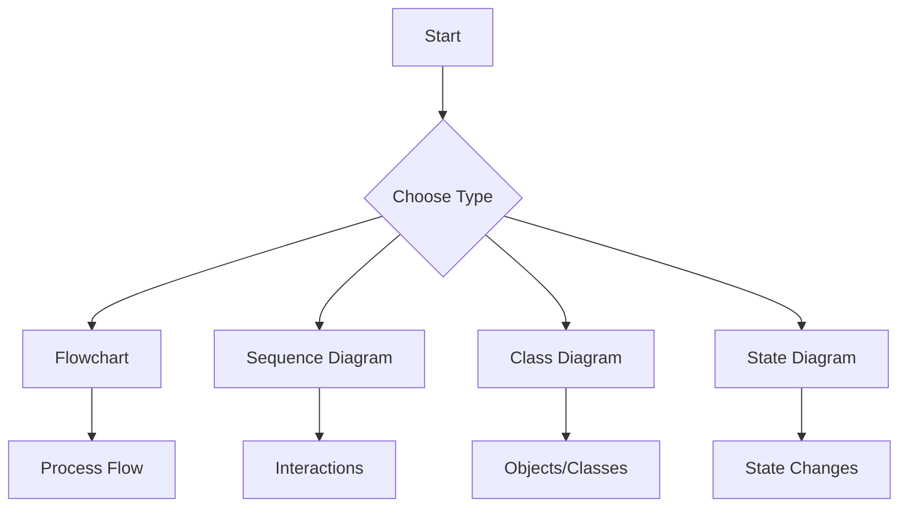
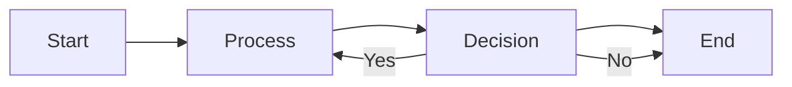
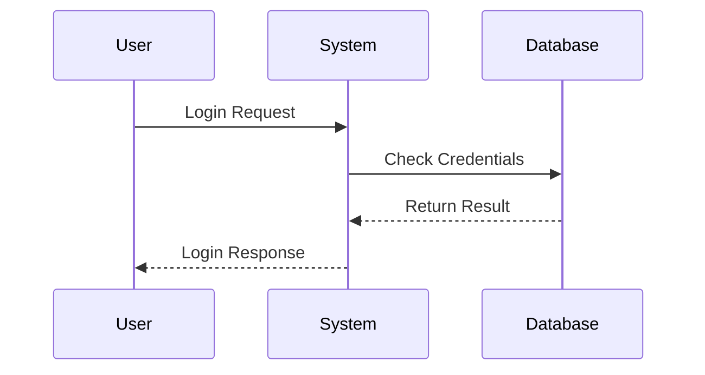
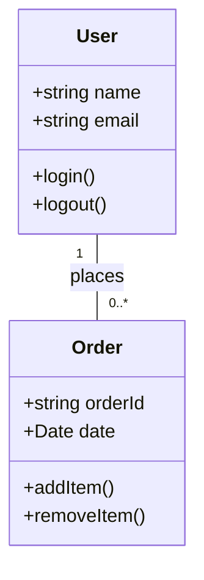

# MermaidStudio User Guide

Welcome to MermaidStudio! This guide will help you get started with creating, editing, and managing Mermaid diagrams using our modern web-based editor.

## Table of Contents

1. [Getting Started](#getting-started)
2. [Creating Your First Diagram](#creating-your-first-diagram)
3. [Working with the Editor](#working-with-the-editor)
4. [Using the Visual Editor](#using-the-visual-editor)
5. [AI Assistance](#ai-assistance)
6. [Managing Your Diagrams](#managing-your-diagrams)
7. [Templates and Libraries](#templates-and-libraries)
8. [Exporting and Sharing](#exporting-and-sharing)
9. [Keyboard Shortcuts](#keyboard-shortcuts)
10. [Troubleshooting](#troubleshooting)

## Getting Started

### What is MermaidStudio?

MermaidStudio is a modern web-based editor for creating and editing Mermaid diagrams. It provides:

- **Code Editor**: Syntax-highlighted code editor with live preview
- **Visual Editor**: Drag-and-drop interface for visual diagram creation
- **AI Integration**: AI-powered diagram generation and assistance
- **Multi-tab Support**: Work on multiple diagrams simultaneously
- **Version History**: Track changes and revert to previous versions
- **Template Library**: Pre-built templates for common diagrams
- **Export Options**: Export as PNG, JPEG, SVG, or share via link

### System Requirements

- Modern web browser (Chrome, Firefox, Safari, Edge)
- Internet connection for AI features (optional for offline use)
- No installation required - works directly in your browser

### Accessing MermaidStudio

1. Navigate to [app.mermaidstudio.com](https://app.mermaidstudio.com)
2. The application will load directly in your browser
3. No sign-up required - start creating immediately!

## Creating Your First Diagram

### Starting a New Diagram

1. Click the **"New Diagram"** button in the top toolbar
2. A new tab will open with an empty diagram
3. You can now start typing your Mermaid syntax

### Choosing a Diagram Type

Mermaid supports various diagram types. Here are the most common:



### Basic Mermaid Syntax

#### Flowchart


#### Sequence Diagram


#### Class Diagram


## Working with the Editor

### The Main Interface


The interface consists of:

1. **Top Toolbar**: Main actions and tools
2. **Sidebar**: File/folder navigation and quick access
3. **Workspace**: Editor and preview panels
4. **Status Bar**: Current status and information

### Code Editor Features

1. **Syntax Highlighting**: Mermaid syntax is highlighted for better readability
2. **Live Preview**: Updates as you type with a 300ms debounce
3. **Error Display**: Shows syntax errors in real-time
4. **Auto-completion**: Provides suggestions for Mermaid keywords

#### Using the Editor

```typescript
// Start typing your diagram code
const diagramCode = `flowchart TD
    A[Start] --> B{Condition}
    B -->|Yes| C[Action 1]
    B -->|No| D[Action 2]
`;

// The preview updates automatically
renderDiagram(diagramCode, 'my-diagram');
```

### Split View

Use the split view to see both code and preview:

- **Drag the divider** to resize panels
- **Click the fullscreen icon** for full preview
- **Toggle AI panel** on the right for assistance

## Using the Visual Editor

### Accessing Visual Mode

1. Click the **"Visual Editor"** button in the toolbar
2. Switch from code view to drag-and-drop interface

### Creating Diagram Visually

1. **Drag Shapes** from the toolbar
2. **Connect Nodes** by dragging from connection points
3. **Edit Text** by double-clicking shapes
4. **Style Elements** using the properties panel

### Shape Toolbar

Available shapes:

- Rectangle (process)
- Circle (start/end)
- Diamond (decision)
- Parallelogram (input/output)
- Cylinder (database)

### Styling Options

- Colors: Fill and stroke colors
- Fonts: Size, weight, and family
- Layout: Auto-arrange with Dagre/ELK
- Grid: Snap to grid for precise alignment

## AI Assistance

### Generating Diagrams with AI

1. Click the **"AI Generate"** button (lightning icon)
2. Type a description of what you want
3. Select an AI provider (OpenAI, Anthropic, etc.)
4. Click **"Generate"**

#### Example Prompts

```
"Create a flowchart for user registration process"
"Design a sequence diagram for e-commerce checkout"
"Generate a class diagram for a blog system"
```

### Fixing Diagrams with AI

When you encounter errors:

1. Select the error in the editor
2. Click **"Fix with AI"**
3. AI will suggest corrections
4. Accept or modify the suggestion

### Improving Diagrams

Use AI to enhance existing diagrams:

1. Select text or entire diagram
2. Click **"Improve with AI"**
3. Add instructions like:
   - "Make it more detailed"
   - "Add error handling"
   - "Include additional nodes"

## Managing Your Diagrams

### Saving and Loading

- **Auto-save**: Diagrams save automatically as you type
- **Manual Save**: Press `Ctrl+S` (Cmd+S on Mac)
- **Save As**: Click "Save As" to create a copy

### Folders and Organization

1. Use the sidebar to create folders
2. Drag diagrams between folders
3. Organize by project or diagram type

### Version History

Track changes to your diagrams:

1. Click **"Show History"**
2. View previous versions
3. Restore any version with one click

#### Features

- **50 versions retained** per diagram
- **Compare versions** side by side
- **Restore with one click**
- **Timestamps** for each version

### Tags and Search

Add tags to organize your diagrams:

```typescript
// Add tags when saving
const diagram = {
  id: 'diagram-123',
  title: 'User Registration',
  tags: ['authentication', 'flowchart', 'web']
};

// Search by tag or content
const results = searchDiagrams('registration');
```

## Templates and Libraries

### Using Templates

1. Click **"Templates"** in the toolbar
2. Browse categories:
   - Flowcharts
   - Sequence Diagrams
   - Class Diagrams
   - UI Mockups
   - Architecture Diagrams
3. Click "Use Template" to start

### Custom Templates

Save your own diagrams as templates:

1. Create a diagram you want to reuse
2. Click **"Save as Template"**
3. Add name and description
4. Access from template library

### Template Library Categories

| Category | Description | Examples |
|----------|-------------|----------|
| Flowcharts | Process flows and workflows | Registration, checkout, approval |
| Sequence | Object interactions | API calls, user journeys |
| Class | Object-oriented design | Entity models, domain models |
| UI/UX | Interface designs | Wireframes, mockups |
| Architecture | System designs | Microservices, infrastructure |

## Exporting and Sharing

### Export Options

1. Click **"Export"** button
2. Choose format:
   - **PNG**: Best for documents
   - **JPEG**: Smaller file size
   - **SVG**: Scalable vector graphics
   - **PDF**: Print-ready format

3. Select size and quality
4. Download or copy to clipboard

### Sharing Links

1. Click **"Share"** button
2. Generate shareable link
3. Options:
   - **View only**: Anyone can view
   - **Edit access**: Allow editing
   - **Password protected**: Secure sharing

4. Copy link and share

### Embedding Diagrams

Embed diagrams in other websites:

```html
<!-- HTML Embed -->
<div class="mermaid-diagram">
  flowchart TD
    A[Start] --> B[Process] --> C[End]
</div>

<script src="https://cdn.jsdelivr.net/npm/mermaid/dist/mermaid.min.js"></script>
<script>
  mermaid.initialize({ startOnLoad: true });
</script>
```

## Keyboard Shortcuts

### Editor Shortcuts

| Shortcut | Action |
|----------|--------|
| `Ctrl/Cmd + S` | Save diagram |
| `Ctrl/Cmd + N` | New diagram |
| `Ctrl/Cmd + O` | Open diagram |
| `Ctrl/Cmd + F` | Find in editor |
| `Ctrl/Cmd + /` | Toggle comment |
| `Ctrl/Cmd + D` | Duplicate line |
| `Alt + ↑/↓` | Move line up/down |
| `Ctrl/Cmd + Z` | Undo |
| `Ctrl/Cmd + Y` | Redo |

### Navigation Shortcuts

| Shortcut | Action |
|----------|--------|
| `Ctrl/Cmd + T` | New tab |
| `Ctrl/Cmd + W` | Close tab |
| `Ctrl/Cmd + 1-9` | Switch to tab |
| `Ctrl/Cmd + Tab` | Next tab |
| `Ctrl/Cmd + Shift + Tab` | Previous tab |

### AI Shortcuts

| Shortcut | Action |
|----------|--------|
| `Ctrl/Cmd + Shift + G` | Generate with AI |
| `Ctrl/Cmd + Shift + F` | Fix with AI |
| `Ctrl/Cmd + Shift + I` | Improve with AI |

### UI Shortcuts

| Shortcut | Action |
|----------|--------|
| `F11` | Toggle fullscreen |
| `Ctrl/Cmd + B` | Toggle sidebar |
| `Ctrl/Cmd + K` | Command palette |
| `Ctrl/Cmd + ,` | Settings |
| `Ctrl/Cmd + H` | Help |

## Troubleshooting

### Common Issues

#### Diagram Not Rendering

**Problem**: Preview shows "Syntax error" or nothing

**Solutions**:
1. Check for missing keywords (`graph`, `sequenceDiagram`, etc.)
2. Ensure proper indentation
3. Close all brackets and quotes
4. Use the **"Check Syntax"** button

#### AI Not Working

**Problem**: AI features not responding

**Solutions**:
1. Check internet connection
2. Verify API key is set
3. Try different AI provider
4. Check provider status

#### Slow Performance

**Problem**: Editor is laggy

**Solutions**:
1. Close unused tabs
2. Clear browser cache
5. Disable other extensions
6. Use incognito mode

### Error Messages

#### "Invalid diagram content"

- Cause: Malformed Mermaid syntax
- Solution: Check syntax and indentation

#### "Storage quota exceeded"

- Cause: Browser storage full
- Solution: Delete old diagrams or upgrade plan

#### "AI service unavailable"

- Cause: API provider down
- Solution: Try different provider or wait

### Getting Help

1. **Help Menu**: Access help documentation
2. **Community**: Join our Discord community
3. **GitHub**: Report issues on GitHub
4. **Feedback**: Send feedback through the app

### Best Practices

1. **Start Simple**: Begin with basic diagrams before complex ones
2. **Use Comments**: Add `%% comments` to explain complex parts
3. **Version Control**: Save frequently to avoid data loss
4. **Organize**: Use folders and tags to keep diagrams organized
5. **Backup**: Export important diagrams regularly

### Tips and Tricks

1. **Copy-Paste**: Diagram code is plain text, easy to copy
2. **Preview First**: Use split view to see live changes
3. **Keyboard Shortcuts**: Learn shortcuts for faster editing
4. **Template Library**: Save time with pre-built templates
5. **AI Prompts**: Be specific with AI for better results

## Next Steps

- Explore advanced Mermaid features
- Join our community for tips and tricks
- Contribute to the project on GitHub
- Check out our tutorial videos

Happy diagramming! 🎨