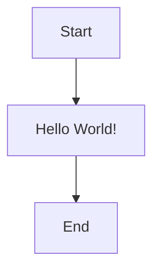
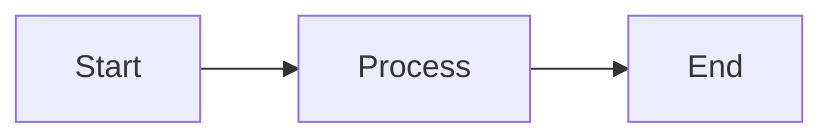
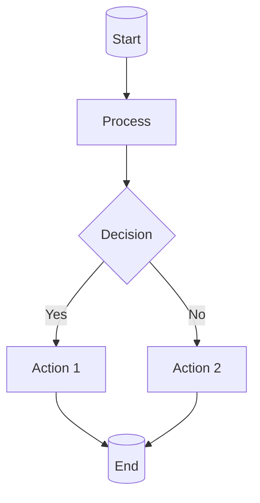
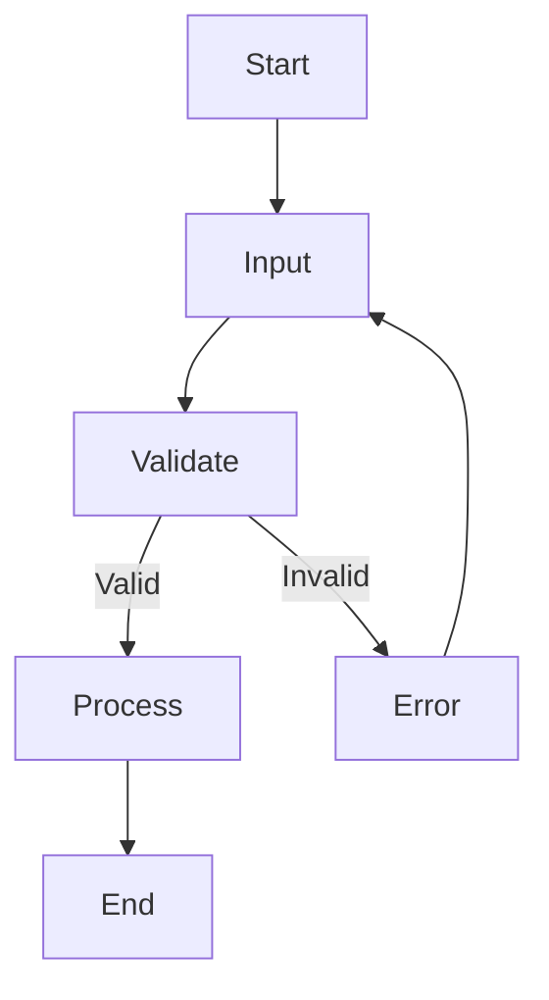
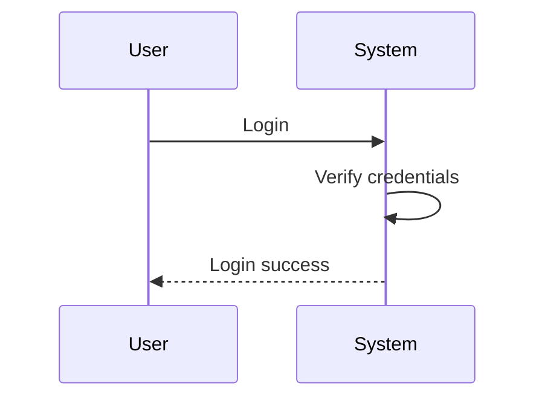
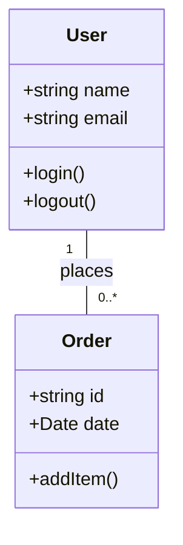

# Quick Start Guide

Get up and running with MermaidStudio in minutes!

## 1. First Time Setup

### Open MermaidStudio
1. Navigate to [app.mermaidstudio.com](https://app.mermaidstudio.com)
2. The app loads directly in your browser
3. No sign-up required!

### Familiarize Yourself
- **Top Toolbar**: Main actions (New, Open, Save, Export)
- **Sidebar**: Your diagrams and folders
- **Workspace**: Editor (left) and Preview (right)
- **Status Bar**: Current status and info

## 2. Create Your First Diagram

### Option A: From Scratch
1. Click **"New Diagram"** in the toolbar
2. Type your Mermaid code in the editor
3. See live preview update automatically

### Option B: Use a Template
1. Click **"Templates"** button
2. Choose from categories (Flowcharts, Sequences, etc.)
3. Click "Use Template"

### Option C: Generate with AI
1. Click lightning bolt icon (**"AI Generate"**)
2. Type: "Create a simple flowchart"
3. Choose AI provider
4. Click "Generate"

## 3. Basic Editing

### Simple Flowchart

- **Type directly** in the editor
- **Preview updates** as you type
- **Errors** show in red text

### Common Elements

### Keyboard Shortcuts
- `Ctrl/Cmd + S` - Save
- `Ctrl/Cmd + N` - New
- `Ctrl/Cmd + /` - Comment
- `F11` - Fullscreen

## 4. Save and Organize

### Saving Diagrams
1. **Auto-save** happens as you type
2. **Manual save** with `Ctrl + S`
3. **Save As** to create a copy

### Creating Folders
1. Click **"+"** in sidebar
2. Enter folder name
3. Drag diagrams into folders

### Adding Tags
When saving:
1. Enter tags separated by commas
2. Example: `flowchart, user, onboarding`

## 5. Export Your Work

### Quick Export
1. Click **"Export"** button
2. Choose format:
   - PNG (for documents)
   - SVG (scalable)
   - PDF (print-ready)
3. Download or copy

### Share Online
1. Click **"Share"**
2. Copy shareable link
3. Choose view/edit permissions

## 6. Advanced Features

### AI Assistance
- **Generate**: "Create user login flow"
- **Fix**: Select error + "Fix with AI"
- **Improve**: Select text + "Improve with AI"

### Version History
1. Click **"History"**
2. See all previous versions
3. Restore any version with one click

### Visual Editor
1. Click **"Visual Editor"**
2. Drag shapes onto canvas
3. Connect nodes automatically
4. Style with colors and fonts

## 7. Common Tasks

### Creating a Flowchart

### Creating a Sequence Diagram

### Creating a Class Diagram

## 8. Troubleshooting

### Preview Not Working?
- Check for syntax errors
- Ensure brackets are closed
- Try "Check Syntax" button

### AI Not Responding?
- Check internet connection
- Verify API key is set
- Try different provider

### Slow Performance?
- Close unused tabs
- Clear browser cache
- Use incognito mode

## 9. Tips & Tricks

### Productivity Tips
1. **Use templates** for common diagrams
2. **Keyboard shortcuts** save time
3. **AI assistance** speeds up creation
4. **Version history** prevents data loss

### Best Practices
1. **Start simple**, then add complexity
2. **Use comments** (`%% This is a note`)
3. **Organize** with folders and tags
4. **Export important** diagrams regularly

## Need Help?

- **Help Menu**: Press `Ctrl + ,` or click Help
- **Keyboard Shortcuts**: See full list in Help
- **Community**: Join our Discord
- **Report Issues**: GitHub repository

---

**Next Steps**:
- Try the [full tutorials](./tutorials.md)
- Explore [advanced features](./advanced.md)
- Check out the [API documentation](../api/README.md)

Happy diagramming! 🎨