# Tutorials

Welcome to the MermaidStudio tutorials section! This guide walks you through common scenarios with step-by-step instructions.

## Tutorial 1: Creating a User Registration Flow

### Goal: Create a complete user registration flowchart

```mermaid
flowchart TD
    A[Start] --> B[Enter Email]
    B --> C{Valid Email?}
    C -->|No| D[Show Error]
    D --> B
    C -->|Yes| E[Check if Exists]
    E --> F{User Exists?}
    F -->|Yes| G[Show "Email Taken"]
    G --> B
    F -->|No| H[Create Account]
    H --> I[Send Welcome Email]
    I --> J[End]
```

### Step-by-Step Instructions

#### 1. Starting the Diagram
1. Click "New Diagram" in the toolbar
2. Select "Flowchart" template
3. Give it a title: "User Registration Flow"

#### 2. Creating the Basic Flow

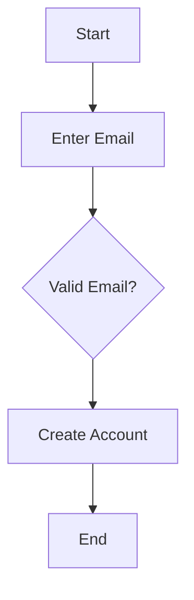

- Type the above code into the editor
- The preview will update automatically

#### 3. Adding Error Handling

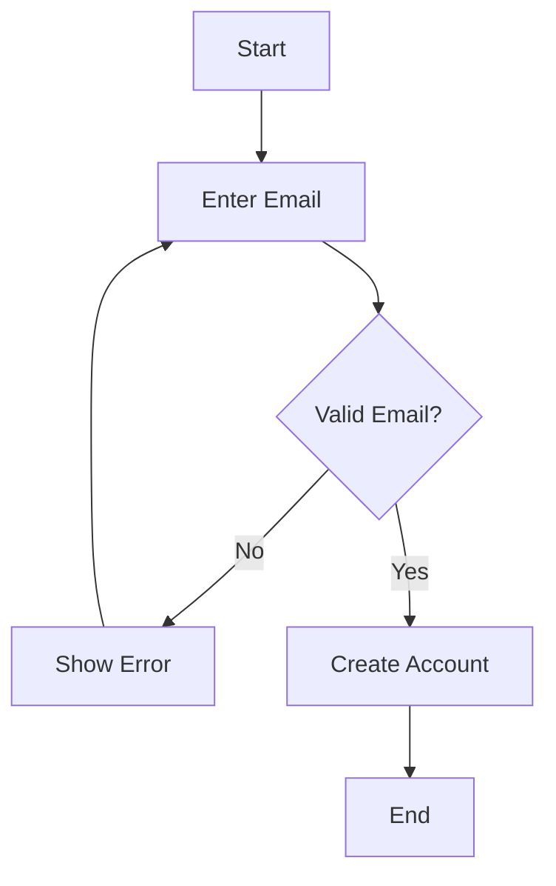

- Add the conditional logic with branches
- Use `|No|` and `|Yes|` to label branches

#### 4. Adding User Existence Check

```mermaid
flowchart TD
    A[Start] --> B[Enter Email]
    B --> C{Valid Email?}
    C -->|No| D[Show Error]
    D --> B
    C -->|Yes| E{User Exists?}
    E -->|Yes| F[Show "Email Taken"]
    F --> B
    E -->|No| G[Create Account]
    G --> H[End]
```

- Add the existence check decision
- Create feedback loops for errors

#### 5. Final Touches

```mermaid
flowchart TD
    A[Start] --> B[Enter Email]
    B --> C{Valid Email?}
    C -->|No| D[Show Error]
    D --> B
    C -->|Yes| E{User Exists?}
    E -->|Yes| F[Show "Email Taken"]
    F --> B
    E -->|No| G[Create Account]
    G --> H[Send Welcome Email]
    H --> I[End]
```

- Add the welcome email step
- Format with consistent spacing

#### 6. Styling the Diagram

Use the visual editor to:
- Change colors for different node types
- Add icons to shapes
- Adjust spacing and layout
- Make it more visually appealing

### Complete Code

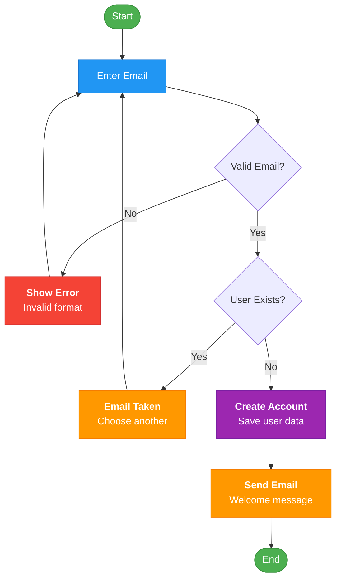

---

## Tutorial 2: Building an E-commerce Sequence Diagram

### Goal: Model the checkout process in an e-commerce application

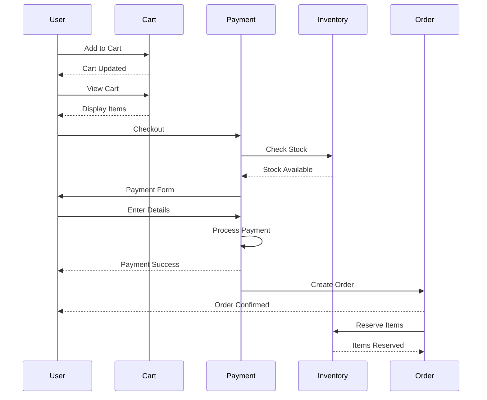

### Step-by-Step Implementation

#### 1. Create the Basic Structure

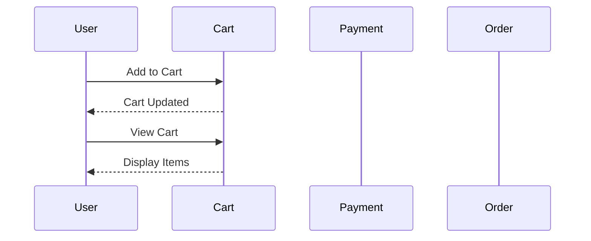

- Define all participants first
- Add initial cart interactions

#### 2. Add Checkout Process

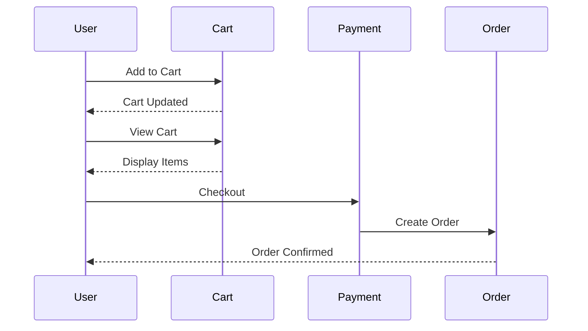

- Add the checkout initiation
- Connect to order creation

#### 3. Add Payment Flow

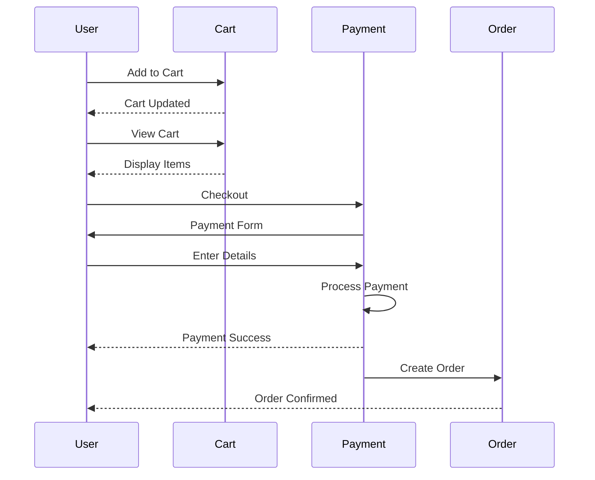

- Add payment form interaction
- Include payment processing steps

#### 4. Add Inventory Check

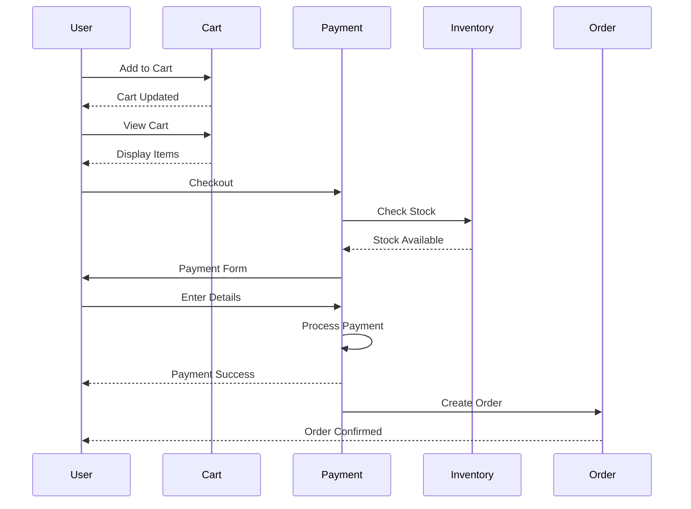

- Add inventory service participant
- Include stock validation

#### 5. Add Order Processing


- Complete the order flow
- Add inventory reservation

### Complete Implementation

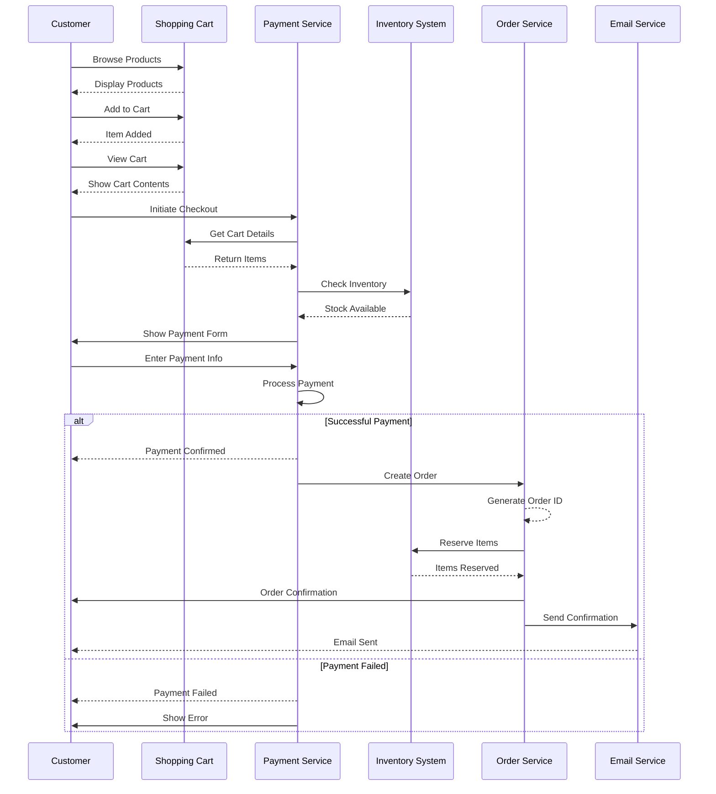

---

## Tutorial 3: Designing a Class Diagram for a Blog System

### Goal: Create a domain model for a blog application

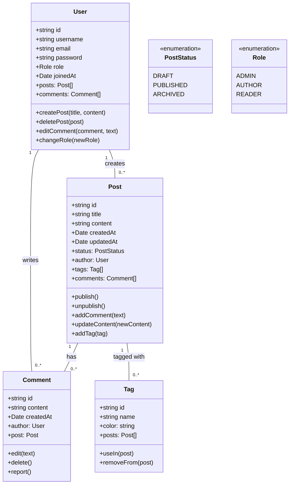

### Building the Class Diagram

#### 1. Define Core Entities

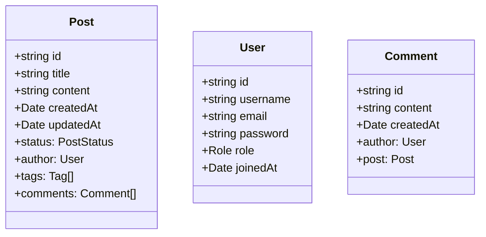

- Start with basic entities
- Add core attributes

#### 2. Add Methods and Relationships

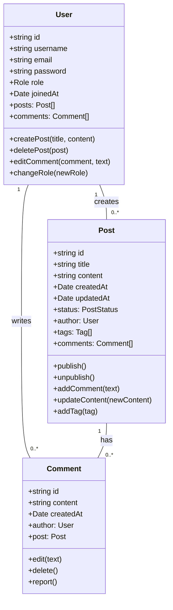

- Add methods to each class
- Define relationships

#### 3. Add Supporting Classes


- Add enumeration classes
- Complete relationships

### Advanced Features

#### Using Notes and Stereotypes

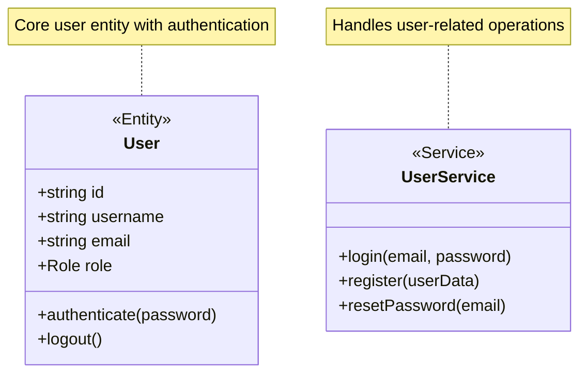

#### Adding Constraints

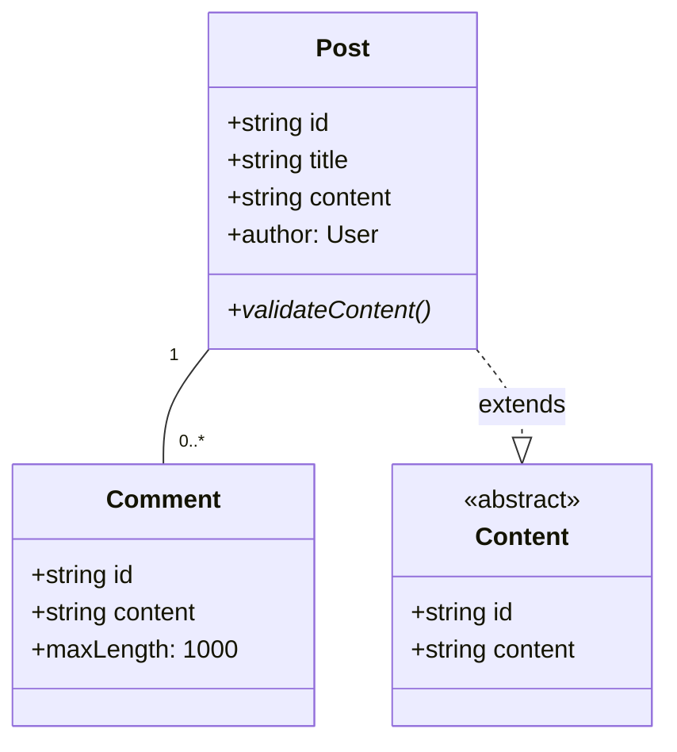

---

## Tutorial 4: Building an Architecture Diagram

### Goal: Design a microservices architecture

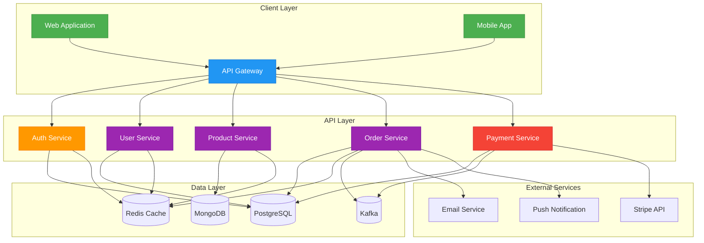

### Creating the Architecture Diagram

#### 1. Define Layers

```mermaid
graph TB
    subgraph "Client Layer"
        Web[Web Application]
        Mobile[Mobile App]
        API_Gateway[API Gateway]
    end

    subgraph "API Layer"
        Auth[Auth Service]
        Users[User Service]
        Products[Product Service]
        Orders[Order Service]
        Payments[Payment Service]
    end

    subgraph "Data Layer"
        Redis[(Redis Cache)]
        PostgreSQL[(PostgreSQL)]
        MongoDB[(MongoDB)]
    end
```

- Separate into logical layers
- Add main components

#### 2. Add External Services

```mermaid
graph TB
    subgraph "Client Layer"
        Web[Web Application]
        Mobile[Mobile App]
        API_Gateway[API Gateway]
    end

    subgraph "API Layer"
        Auth[Auth Service]
        Users[User Service]
        Products[Product Service]
        Orders[Order Service]
        Payments[Payment Service]
    end

    subgraph "Data Layer"
        Redis[(Redis Cache)]
        PostgreSQL[(PostgreSQL)]
        MongoDB[(MongoDB)]
    end

    subgraph "External Services"
        Stripe[Stripe API]
        Email[Email Service]
    end
```

- Include third-party services
- Show integrations

#### 3. Connect Components

```mermaid
graph TB
    subgraph "Client Layer"
        Web[Web Application]
        Mobile[Mobile App]
        API_Gateway[API Gateway]
    end

    subgraph "API Layer"
        Auth[Auth Service]
        Users[User Service]
        Products[Product Service]
        Orders[Order Service]
        Payments[Payment Service]
    end

    subgraph "Data Layer"
        Redis[(Redis Cache)]
        PostgreSQL[(PostgreSQL)]
        MongoDB[(MongoDB)]
    end

    subgraph "External Services"
        Stripe[Stripe API]
        Email[Email Service]
    end

    Web --> API_Gateway
    Mobile --> API_Gateway

    API_Gateway --> Auth
    API_Gateway --> Users
    API_Gateway --> Products
    API_Gateway --> Orders
    API_Gateway --> Payments

    Auth --> PostgreSQL
    Users --> PostgreSQL
    Products --> MongoDB
    Orders --> PostgreSQL
    Payments --> PostgreSQL

    Payments --> Stripe
    Orders --> Email
```

- Add data flow connections
- Show service interactions

#### 4. Style the Diagram

```mermaid
graph TB
    subgraph "Client Layer"
        Web[Web Application]
        Mobile[Mobile App]
        API_Gateway[API Gateway]
    end

    subgraph "API Layer"
        Auth[Auth Service]
        Users[User Service]
        Products[Product Service]
        Orders[Order Service]
        Payments[Payment Service]
    end

    subgraph "Data Layer"
        Redis[(Redis Cache)]
        PostgreSQL[(PostgreSQL)]
        MongoDB[(MongoDB)]
    end

    subgraph "External Services"
        Stripe[Stripe API]
        Email[Email Service]
    end

    Web --> API_Gateway
    Mobile --> API_Gateway

    API_Gateway --> Auth
    API_Gateway --> Users
    API_Gateway --> Products
    API_Gateway --> Orders
    API_Gateway --> Payments

    Auth --> PostgreSQL
    Users --> PostgreSQL
    Products --> MongoDB
    Orders --> PostgreSQL
    Payments --> PostgreSQL

    Payments --> Stripe
    Orders --> Email

    style Web fill:#4CAF50,stroke:#388E3C,color:white
    style Mobile fill:#4CAF50,stroke:#388E3C,color:white
    style API_Gateway fill:#2196F3,stroke:#1976D2,color:white
    style Auth fill:#FF9800,stroke:#F57C00,color:white
    style Users fill:#9C27B0,stroke:#7B1FA2,color:white
    style Products fill:#9C27B0,stroke:#7B1FA2,color:white
    style Orders fill:#9C27B0,stroke:#7B1FA2,color:white
    style Payments fill:#f44336,stroke:#d32f2f,color:white
```

- Add colors to distinguish components
- Use consistent styling

---

## Tutorial 5: Using AI to Generate Diagrams

### Goal: Use AI to create and improve diagrams

### Generating a Diagram with AI

1. **Open AI Panel**
   - Click the lightning bolt icon
   - Select your AI provider
   - Enter API key if needed

2. **Write a Clear Prompt**
   ```
   "Create a sequence diagram showing the user registration flow with email verification"
   ```

3. **Review and Edit**
   - AI will generate the diagram
   - Review the code
   - Make manual adjustments if needed

### Common AI Prompts

#### For Flowcharts
```
"Create a flowchart for an order processing system with these steps:
- User places order
- Check inventory
- Process payment
- Ship items
- Send confirmation email"
```

#### For Sequence Diagrams
```
"Create a sequence diagram for a REST API authentication flow:
1. Client sends login request
2. Server validates credentials
3. Server generates JWT
4. Client stores JWT
5. Client includes JWT in subsequent requests"
```

#### For Class Diagrams
```
"Design a class diagram for a simple blog system with:
- User class with login/register
- Post class with title/content
- Comment class
- Tag class
- Show relationships between them"
```

### Improving Existing Diagrams

#### Fixing Errors
1. Select the error in the editor
2. Click "Fix with AI"
3. AI will suggest corrections

#### Adding Details
1. Select part of the diagram
2. Click "Improve with AI"
3. Add instructions like:
   - "Add error handling branches"
   - "Include more detailed steps"
   - "Add authentication checks"

### Best Practices for AI

1. **Be Specific**: Include all requirements in the prompt
2. **Use Examples**: Show similar diagrams if possible
3. **Iterate**: Generate multiple versions and combine
4. **Review**: Always verify AI output
5. **Edit**: Manual editing is often needed

---

## Tutorial 6: Setting Up and Exporting

### Goal: Learn to set up preferences and export diagrams

### Customizing the Interface

1. **Theme Settings**
   - Toggle between dark/light mode
   - Customize colors in advanced settings

2. **Editor Preferences**
   - Set tab size
   - Configure auto-indent
   - Enable line numbers

3. **AI Settings**
   - Set default provider
   - Configure API keys
   - Adjust response length

### Exporting Diagrams

#### Exporting Images

1. Click "Export" button
2. Select format:
   - PNG for documents
   - JPEG for web use
   - SVG for scalability
   - PDF for printing

3. Choose size:
   - Small: 800x600
   - Medium: 1200x900
   - Large: 1600x1200
   - Custom: Specify dimensions

#### Sharing Diagrams

1. Click "Share" button
2. Choose sharing options:
   - Public link
   - Password protected
   - Expiring link

3. Copy the link and share

### Embedding in Documentation

#### Markdown
```markdown
### My Diagram

```mermaid
flowchart TD
    A[Start] --> B[Process]
    B --> C[End]
```
```

#### HTML
```html
<div class="mermaid">
  flowchart TD
    A[Start] --> B[Process]
    B --> C[End]
</div>

<script src="https://cdn.jsdelivr.net/npm/mermaid/dist/mermaid.min.js"></script>
<script>
  mermaid.initialize({ startOnLoad: true });
</script>
```

### Saving as Templates

1. Create a reusable diagram
2. Click "Save as Template"
3. Add name and description
4. Tags for organization
5. Access from template library

### Batch Operations

#### Export Multiple Diagrams
1. Select diagrams in sidebar
2. Right-click and choose "Export Selected"
3. Choose format and location
4. All diagrams will be exported

#### Copy Between Projects
1. Open source diagram
2. Click "Copy to Clipboard"
3. Paste into target project
4. Adjust as needed

---

## Conclusion

These tutorials cover the most common use cases for MermaidStudio. Practice with different diagram types and explore the AI features to create professional diagrams quickly. Remember to save your work regularly and use version history for important diagrams.